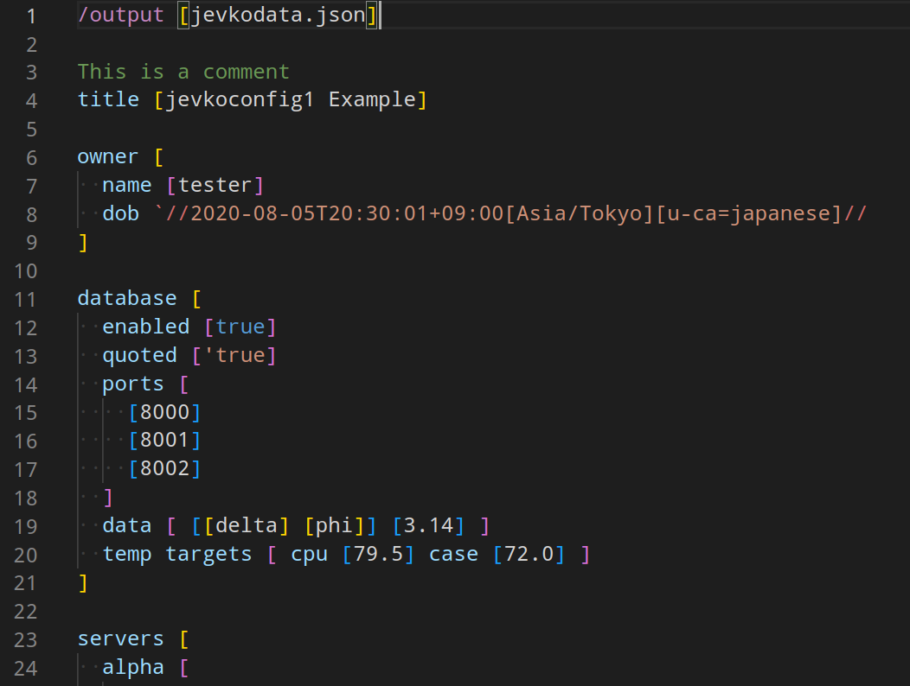
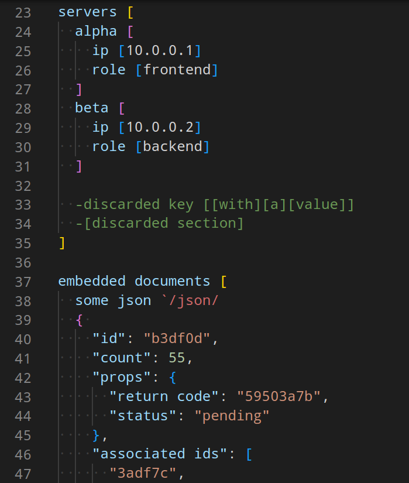
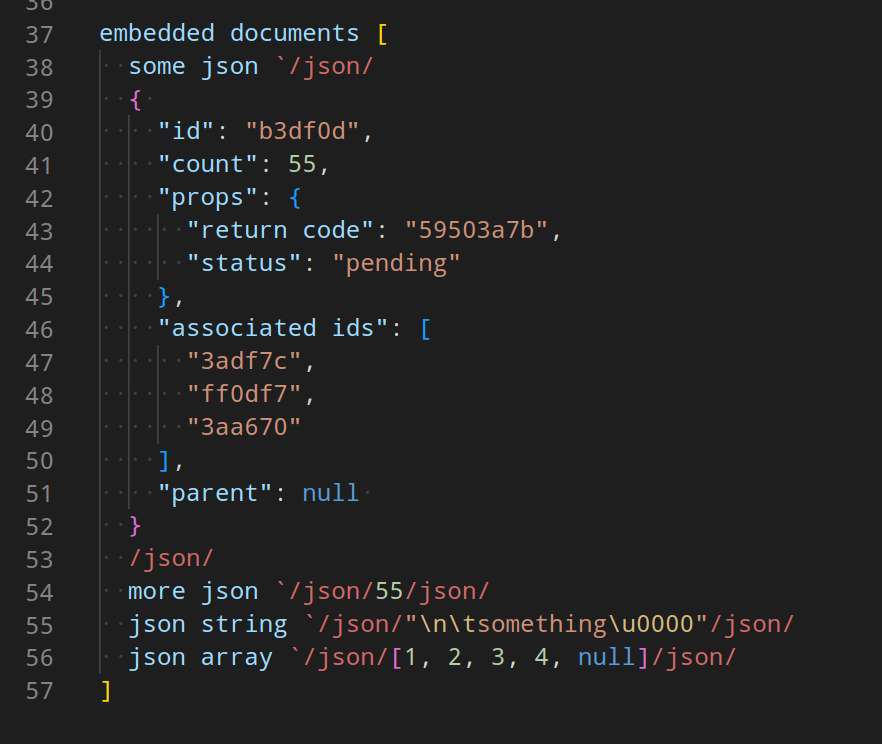

# jevkodata-basic-highlighting-vscode

Basic syntax highlighting for .jevkodata in Visual Studio Code.

NOTE: experimental.

This extension is published to the [Visual Studio Marketplace](https://marketplace.visualstudio.com/items?itemName=jevko.jevkodata-basic-highlighting) as well as the [Open VSX Registry](https://open-vsx.org/extension/jevko/jevkodata-basic-highlighting).

## Installation

Launch VS Code Quick Open (Ctrl+P), paste the following command, and press enter.

```
ext install jevko.jevkodata-basic-highlighting
```

## Features

Basic syntax highlighting for .jevkodata that works in Visual Studio Code.





<!-- Includes experimental support for heredocs. -->

<!-- todo: expand on heredocs -->

<!-- ## Requirements

If you have any requirements or dependencies, add a section describing those and how to install and configure them. -->

<!-- ## Extension Settings

Include if your extension adds any VS Code settings through the `contributes.configuration` extension point.

For example:

This extension contributes the following settings:

* `myExtension.enable`: enable/disable this extension
* `myExtension.thing`: set to `blah` to do something -->

## Release Notes

See [CHANGELOG.md](CHANGELOG.md).

## Installation of the latest development snapshot directly from the git repository

To start using this extension with Visual Studio Code copy the folder that contains this repository into the `<user home>/.vscode/extensions` folder and restart Code.

Files with the .jevkodata extension now should have syntax highlighting.